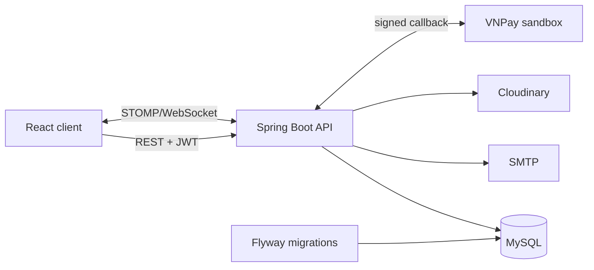

<div align="center">
  <h1>Mini Bookstore</h1>
  <p>Full-stack e-commerce platform for browsing books, managing inventory and processing orders.</p>
  <p>
    <a href="https://github.com/toantran-tech/mini-bookstore/actions/workflows/ci.yml">
      
    </a>
  </p>
</div>

## Live deployment

- Frontend (Vercel): [mini-bookstore-git-main-toantran00s-projects.vercel.app](https://mini-bookstore-git-main-toantran00s-projects.vercel.app)
- Backend API (Render): [mini-bookstore-54a8.onrender.com](https://mini-bookstore-54a8.onrender.com)
- Swagger UI: [API documentation](https://mini-bookstore-54a8.onrender.com/swagger-ui/index.html)

The backend uses Render's free instance and may take around 50 seconds to respond after a period of inactivity.

## Highlights

- Secure JWT authentication with refresh-token revocation and email OTP registration.
- Product search, pagination, lazy-loaded routes/images, cart, wishlist and reviews.
- Checkout with discount coupons and verified, idempotent VNPay callbacks.
- Admin dashboard for books, categories, users, coupons, orders and revenue reporting.
- Real-time order notifications through STOMP/WebSocket.
- Flyway-managed MySQL schema with Hibernate validation.
- Isolated MySQL integration tests with Testcontainers; no test touches the development or deployed database.
- CI gates for backend tests, frontend lint and production build.

## Architecture



## Tech stack

| Layer | Technologies |
| --- | --- |
| Frontend | React 19, Vite, Tailwind CSS 4, Redux Toolkit, React Router, Axios, Recharts, STOMP |
| Backend | Java 17, Spring Boot 3.4, Spring Security, Spring Data JPA, Bean Validation, WebSocket |
| Data | MySQL 8, Flyway |
| Testing | JUnit 5, Mockito, MockMvc, Testcontainers |
| Delivery | Docker, Nginx, GitHub Actions, Vercel, Render |

## Run with Docker

Prerequisite: Docker Desktop or Docker Engine with Compose.

```bash
docker compose up --build
```

Then open:

- Frontend: `http://localhost:5173`
- Backend: `http://localhost:8080`
- Swagger UI: `http://localhost:8080/swagger-ui/index.html`

The default Compose values are for local demonstration only. Browsing and core database flows work without external credentials; email OTP, Cloudinary uploads and VNPay require real sandbox credentials from `.env.example`.

Stop the stack with:

```bash
docker compose down
```

Add `-v` only when you intentionally want to delete the local MySQL volume.

## Run without Docker

### Prerequisites

- JDK 17+
- Node.js 20+
- MySQL 8+

Create an empty `minibookstore` database, copy `.env.example` values into the environment, then start the backend:

```bash
mvn spring-boot:run
```

Start the frontend in another terminal:

```bash
cd frontend
npm ci
npm run dev
```

Flyway applies migrations from `src/main/resources/db/migration`; Hibernate uses `ddl-auto=validate` and never creates production tables implicitly.

For an existing non-empty database that has never used Flyway, set `FLYWAY_BASELINE_ON_MIGRATE=true` for the first migration only, then return it to `false`.

## Configuration

| Variable | Purpose |
| --- | --- |
| `DATABASE_URL`, `DATABASE_USERNAME`, `DATABASE_PASSWORD` | MySQL connection |
| `JWT_SECRET` | JWT signing key of at least 32 bytes |
| `FRONTEND_URL` | Comma-separated HTTP/WebSocket origin allowlist |
| `MAIL_USERNAME`, `MAIL_PASSWORD` | SMTP credentials for OTP and order emails |
| `CLOUDINARY_CLOUD_NAME`, `CLOUDINARY_API_KEY`, `CLOUDINARY_API_SECRET` | Image storage |
| `VNPAY_TMN_CODE`, `VNPAY_HASH_SECRET` | VNPay sandbox credentials |
| `VNPAY_RETURN_URL`, `FRONTEND_PAYMENT_RETURN_URL` | Verified payment callback and frontend redirect |
| `FLYWAY_BASELINE_ON_MIGRATE` | One-time adoption flag for an existing schema |

Never commit populated `.env` files or production credentials.

## Tests and quality gates

Docker must be running because integration tests create a disposable MySQL 8 container.

```bash
mvn clean test
cd frontend
npm run lint
npm run build
```

The integration suite covers registration/login, user/admin authorization, order creation, coupon usage, inventory updates, valid VNPay callbacks, invalid signatures and repeated callbacks. Each database test rolls back automatically.

## API errors

REST failures use one stable response shape:

```json
{
  "status": 400,
  "message": "Dữ liệu không hợp lệ",
  "timestamp": "2026-07-14T10:30:00",
  "path": "/api/orders"
}
```

Authentication and authorization failures follow the same contract. VNPay callback failures redirect to the payment-result page because they are browser callbacks rather than normal JSON API requests.

## Security notes

- Passwords are hashed with BCrypt and public registration always grants `ROLE_USER`.
- Protected routes use Spring Security method/endpoint authorization.
- VNPay signatures, transaction references and paid amounts are verified server-side.
- Payment processing is idempotent and uses pessimistic locking for inventory updates.
- HTTP and WebSocket origins use an explicit allowlist.
- Browser token storage remains a documented hardening area for future HttpOnly-cookie migration.
